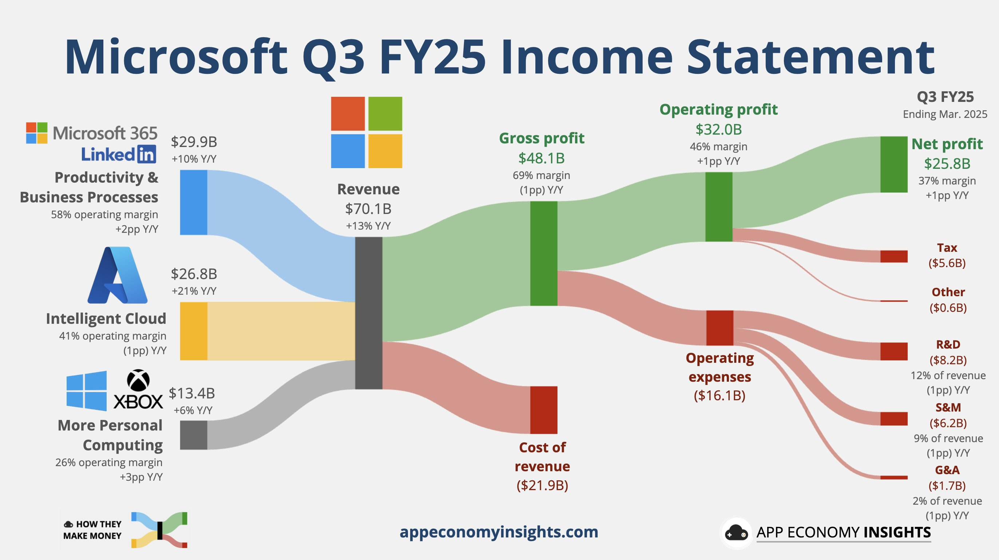
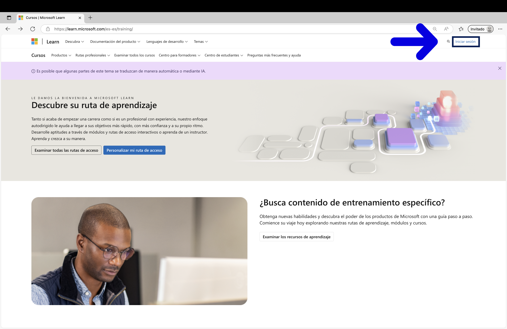
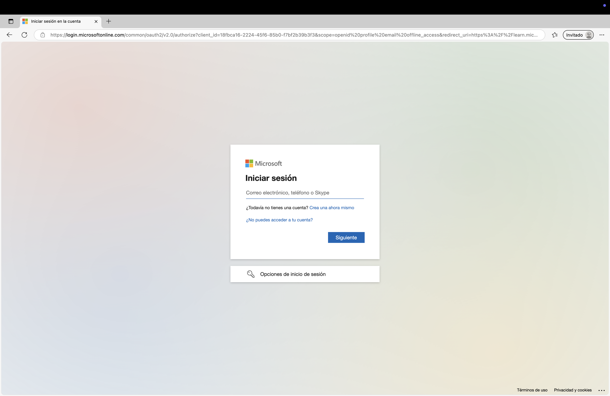
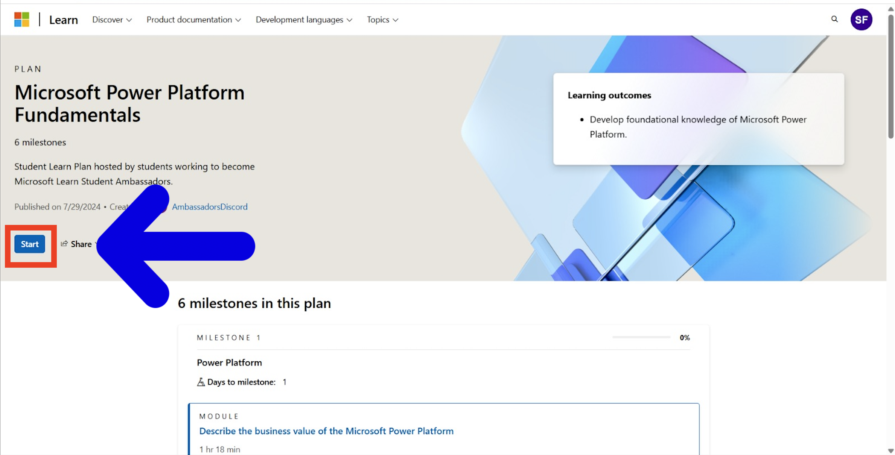
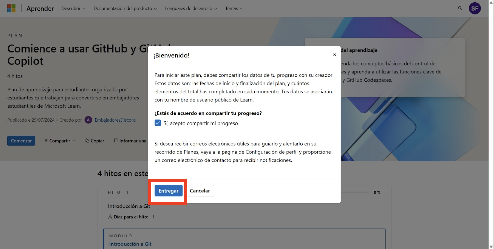
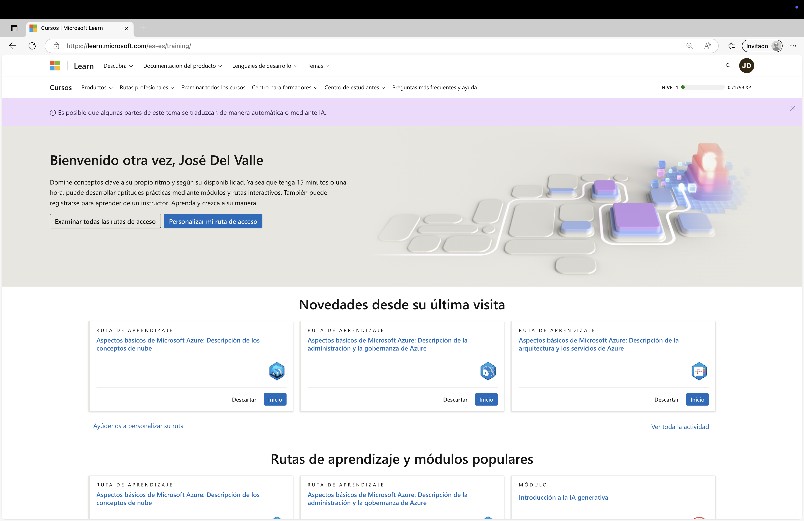

# MLSA

# 📚 Rutas de aprendizaje de Microsoft Learn

Este repositorio recopila algunas de las principales rutas de aprendizaje gratuitas de Microsoft para ayudarte a desarrollar habilidades en la nube, IA, datos, seguridad, desarrollo y más.

---
> ⚠️ **Nota importante:**  
> Después de entrar al curso, **asegúrate de hacer clic en el botón “Comenzar”** en la parte izquierda de la página. ([Paso 4](./img/cap45.jpg))
> 
> 🔒 **Si no haces clic en “Comenzar”, tu progreso no se guardará** y no podrás hacer seguimiento de tu avance ni compartirlo con tu equipo o comunidad.

## 🗂️ Cursos

| Curso | Enlace |
|--------|--------|
| Fundamentos de Azure | [Ir al curso](https://learn.microsoft.com/en-us/plans/qdwwbm3p0x7gom?tab=tab-created&learnerGroupId=511b4e1a-a04b-42b1-8529-b5ca3b9d85da&wt.mc_id=studentamb_454878) |
| Fundamentos de IA de Azure | [Ir al curso](https://learn.microsoft.com/en-us/plans/8pkkiy5x76oy7y?tab=tab-created&learnerGroupId=465c3dfb-e4c5-4d6b-8aa3-af35237bd6dc&wt.mc_id=studentamb_454878) |
| Fundamentos de Datos de Azure | [Ir al curso](https://learn.microsoft.com/en-us/plans/8pkkiy5xgxnpmw?tab=tab-created&learnerGroupId=5a196ebf-046f-425b-baf3-9234a6fcb59c&wt.mc_id=studentamb_454878) |
| Fundamentos de Microsoft Power Platform | [Ir al curso](https://learn.microsoft.com/en-us/plans/zkddhk2dw1d1op?tab=tab-created&learnerGroupId=91dd9633-d2b1-4073-8a6a-d971537dba35&wt.mc_id=studentamb_454878) |
| Fundamentos de Seguridad, Cumplimiento e Identidad de Microsoft | [Ir al curso](https://learn.microsoft.com/en-us/plans/5dyyborpmok24n?tab=tab-created&learnerGroupId=fe237206-bf5d-483f-9d0f-281b6f5e925b&wt.mc_id=studentamb_454878) |
| Copilot para Microsoft 365 | [Ir al curso](https://learn.microsoft.com/en-us/plans/o1mmcm6o12jygw?tab=tab-started&source=docs&learnerGroupId=b487643d-bde1-44ed-868d-76b47f83e61d&wt.mc_id=studentamb_454878) |
| Introducción a GitHub y GitHub Copilot | [Ir al curso](https://learn.microsoft.com/en-us/plans/gm88tr6o5y5zyk?tab=tab-created&learnerGroupId=1aec470a-1865-405c-9dc8-9ba905b3f53a&wt.mc_id=studentamb_454878) |
| Comienza con C# | [Ir al curso](https://learn.microsoft.com/en-us/plans/31zzc4mw2wk5re?tab=tab-started&source=docs&learnerGroupId=4ba326f3-5f36-4247-a054-66553b74f710&wt.mc_id=studentamb_454878) |

> 📌 Haz clic en el nombre del curso para acceder directamente a su contenido.

---

## 🧠 Sobre estos cursos

Azure es parte del segmento "Nube Inteligente", el cual generó $26.8 mil millones USD en ingresos, creciendo un 21% año con año.

Este segmento representa una parte enorme del negocio de Microsoft, con un margen operativo del 41%.

Microsoft está apostando fuertemente por la nube. Aprender Azure te da acceso a herramientas de vanguardia y un mercado laboral en rápido crecimiento con alta demanda.

Así que aprender Azure es acceder a uno de los motores principales de ingresos de una de las empresas tecnológicas más importantes del mundo. 💼🚀

---

### 🔍 ¿Qué vas a aprender?

Estos cursos de Microsoft Learn están diseñados para darte bases sólidas en áreas clave de la tecnología moderna:

- **☁️ Computación en la Nube** – Comprende cómo funcionan los servicios en la nube y cómo desplegarlos usando Azure.
- **🤖 Inteligencia Artificial** – Explora los fundamentos de la IA y cómo aplicarlos usando herramientas de Microsoft.
- **📊 Datos y Análisis** – Aprende cómo se almacenan, gestionan y analizan los datos a gran escala.
- **🔐 Seguridad y Cumplimiento** – Descubre cómo proteger los datos y cumplir con los estándares modernos.
- **⚙️ Power Platform y Automatización** – Crea apps de bajo código y automatiza flujos de trabajo con facilidad.
- **💻 Desarrollo de Software** – Mejora tus habilidades de programación con C#, GitHub y GitHub Copilot.

---

## 🚀 Comienza con Microsoft Learn

Sigue estos pasos rápidos para iniciar tu camino en Microsoft Learn y acceder a los cursos anteriores:

### 📝 Guía paso a paso

1. **Ve al sitio de Microsoft Learn**  
   📷 

   👉 [https://learn.microsoft.com](https://learn.microsoft.com)

2. **Crea una cuenta o inicia sesión con una cuenta Microsoft**  
   📷   
   Puedes usar un correo personal (Outlook, Hotmail, etc.) o el correo de tu escuela.

3. **Haz clic en el enlace del curso en la tabla anterior**  
   Esto te llevará directamente a la página del curso.  
   [🗂️ Cursos](https://github.com/JoseDelVallee/MLSA)

4. **Haz clic en “Comenzar” y comparte tu progreso**  
   ✨ **¡Este paso es MUY importante!**
   📷 
   📷     
   Al hacer clic en “Comenzar”, la plataforma comenzará a registrar tu avance y podrás compartir tu progreso con tu equipo o comunidad.

5. **¡Empieza a aprender!**  
   📷   
   La plataforma guarda automáticamente tu progreso — no es necesario terminar todo de una vez.

## 📤 Envía tu constancia de finalización

Una vez que completes un curso, por favor envía tu comprobante de finalización mediante el siguiente formulario:

👉 [**Enviar evidencia aquí**](https://docs.google.com/forms/d/e/1FAIpQLSc-PVQR8njxZKZtbnTkb5tZIz8-ICPguZmwyZnrtvKr1EfDlw/viewform?usp=sharing&ouid=116941962524305950926)

> Esto nos ayuda a llevar un seguimiento de tu progreso y reconocer tu esfuerzo. 🌟
